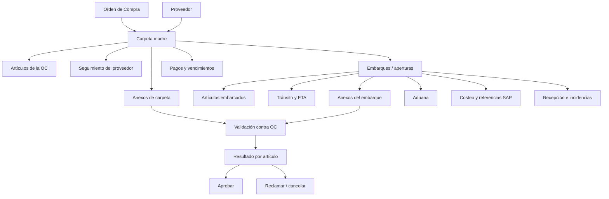
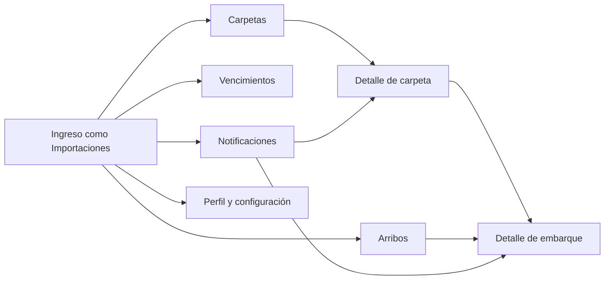
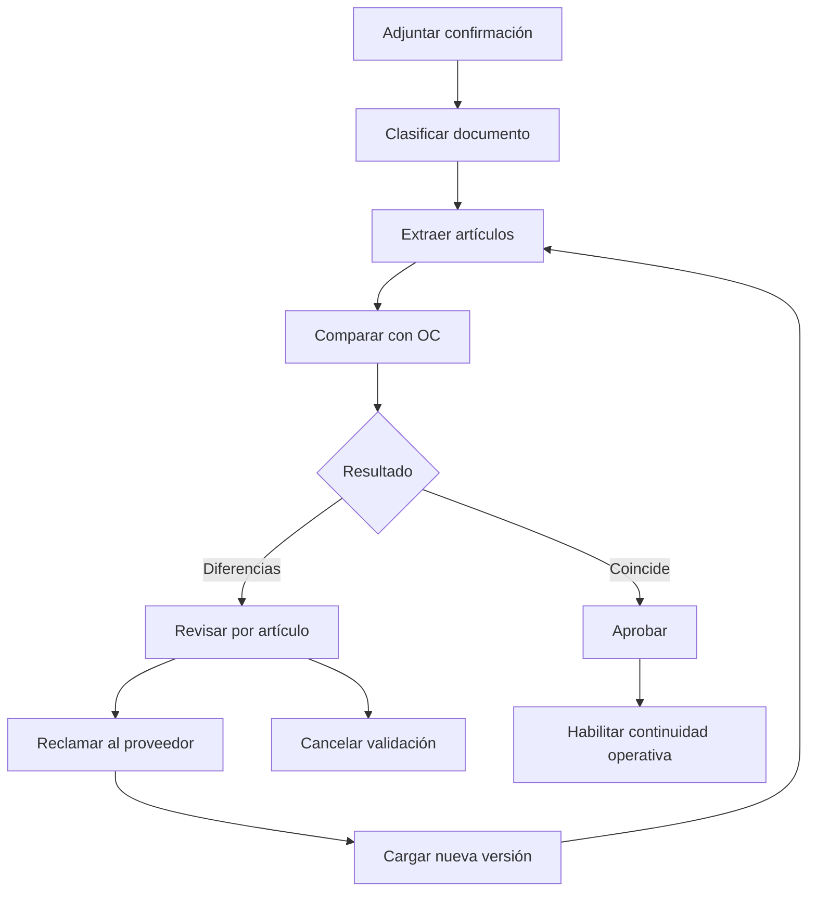

# Arquitectura de la información — Rol Importaciones

## 1. Propósito

Este documento define la arquitectura de la información del rol **Importaciones** para el Sistema de Gestión de Importaciones de Dimagraf. Consolida el modelo funcional previsto en el análisis con la estructura y los comportamientos disponibles en el prototipo actual.

La arquitectura busca que el operador pueda gestionar el ciclo completo de una importación desde una única fuente de verdad, reemplazando la planilla maestra y el seguimiento distribuido entre correos, archivos y controles manuales.

## 2. Fuentes y criterio de lectura

Fuentes principales:

- `Dimagraf_Consolidado_Unificado.md`: ERS, requerimientos UX, funcionales y casos de uso.
- `docs/Ui/Trazabilidad-CU-Pantallas.md`: relación entre casos de uso y pantallas.
- Prototipo React en `src/app/App.tsx` y `src/app/components/*`.
- Datos y taxonomías del prototipo en `src/app/components/mockData.ts`.

Convenciones del documento:

- **Implementado**: existe como pantalla o interacción en el prototipo.
- **Objetivo funcional**: está definido en el análisis y debe orientar la solución final.
- **Parcial**: existe una aproximación en el prototipo, pero no cubre el alcance completo del análisis.

## 3. Usuario, responsabilidad y alcance

### 3.1 Usuario principal

**Actor:** Operador de Importaciones (`AC-001`).

Es el usuario principal del sistema y administra el ciclo operativo de las órdenes de compra. Sus responsabilidades incluyen:

- crear y mantener carpetas de importación;
- cargar y controlar artículos de la OC;
- registrar el seguimiento del proveedor;
- importar documentos y revisar validaciones contra la OC;
- crear y actualizar embarques parciales;
- controlar tránsito, ETA y documentación logística;
- coordinar información aduanera;
- registrar o consultar costos y referencias para SAP;
- consultar vencimientos y pagos;
- seguir la recepción y las incidencias informadas por Depósito.

### 3.2 Límites de responsabilidad

Importaciones tiene edición operativa amplia, pero no reemplaza a los responsables especializados:

| Dominio | Importaciones | Rol responsable complementario |
|---|---|---|
| Carpeta, OC y artículos | Gestiona | Administración mantiene maestros |
| Producción y preembarque | Gestiona | Proveedor aporta documentación |
| Embarques y tránsito | Gestiona | Comercial consulta arribos |
| Aduana | Gestiona y coordina | Despachante carga datos asignados |
| Costeo y referencias SAP | Gestiona | Dirección audita desvíos |
| Pagos | Consulta | Tesorería registra y confirma pagos |
| Recepción e incidencias | Consulta seguimiento | Depósito confirma recepción |

## 4. Principios de organización

1. **La carpeta es el centro de la operación.** Representa una OC de importación y funciona como legajo digital.
2. **La OC es la fuente de verdad.** Los documentos externos se comparan contra sus artículos, cantidades y condiciones.
3. **La navegación respeta la jerarquía de negocio.** Carpeta madre → embarque/apertura → artículo.
4. **Los embarques tienen vida operativa independiente.** Una carpeta puede originar aperturas A, B, C, sin límite funcional.
5. **La información se agrupa por tarea, no por sistema de origen.** El operador encuentra producción, anexos, aduana, costeo y pagos dentro del contexto de la carpeta.
6. **Los estados deben permitir priorizar.** Demoras, diferencias documentales, canal rojo, arribos y vencimientos requieren señales visibles.
7. **La visibilidad depende del rol.** La misma entidad puede ofrecer edición, consulta u ocultamiento de datos según permisos.

## 5. Modelo conceptual de información

### 5.1 Entidades y relaciones

| Entidad | Función informativa | Relación principal |
|---|---|---|
| Carpeta | Identifica y concentra una importación | Una carpeta corresponde a una OC |
| Proveedor | Aporta datos comerciales y parámetros operativos | Un proveedor puede participar en muchas carpetas |
| Artículo OC | Unidad mínima de control, saldo y validación | Pertenece a una carpeta y puede distribuirse entre embarques |
| Embarque / apertura | Instancia logística parcial o total | Una carpeta contiene cero o más embarques |
| Artículo embarcado | Asignación de cantidad a un embarque | Vincula un artículo OC con un embarque |
| Anexo | Documento clasificado y versionado | Puede pertenecer a la carpeta o a un embarque |
| Validación | Comparación de un documento con la OC | Produce un resultado por artículo y una decisión final |
| Registro aduanero | Información de despacho y canal | Pertenece a un embarque |
| Costeo | Gastos, coeficientes y referencias SAP | Se consolida por embarque y carpeta |
| Pago | Obligación financiera y estado | Se vincula a una carpeta |
| Recepción / incidencia | Resultado de la recepción física | Pertenece a un embarque |
| Notificación | Alerta contextual por evento | Puede enlazar a carpeta o embarque |

### 5.2 Regla de identidad

- **Carpeta madre:** `AAAA/NNN`, por ejemplo `2026/514`.
- **Embarque o apertura:** hereda el número y agrega un sufijo secuencial, por ejemplo `2026/514-A`.
- **Artículo:** se identifica principalmente por código SAP/SKU y se complementa con descripción y unidad de medida.
- **Documento:** se identifica por tipo, referencia, versión, fecha y entidad de vinculación.

## 6. Mapa de navegación

### 6.1 Navegación global del rol

| Nivel global | Propósito | Estado en prototipo |
|---|---|---|
| Carpetas | Home operativa y acceso a las OCs activas | Implementado |
| Arribos | Seguimiento transversal de artículos en viaje y ETA | Implementado |
| Vencimientos | Consulta de obligaciones y fechas próximas | Implementado, solo lectura para Importaciones |
| Notificaciones | Priorización de eventos y acceso contextual | Implementado |
| Perfil y configuración | Datos de cuenta, preferencias y sesión | Implementado |

### 6.2 Arquitectura de la carpeta

La carpeta organiza la información mediante pestañas persistentes:

| Orden | Sección visible | Contenido principal | Capacidad de Importaciones |
|---:|---|---|---|
| 1 | General | Cabecera de OC, estado, proveedor, fechas, Incoterm, condición de pago, moneda y referencias | Ver y editar mientras la OC no esté bloqueada |
| 2 | Artículos | Código SAP, descripción, línea, cantidad solicitada, asignada, saldo, UM, precio y validación | Cargar, editar y consultar |
| 3 | Proveedor | Producción, hitos, fechas estimadas, observaciones y seguimiento preembarque | Ver y editar |
| 4 | Embarques | Aperturas activas, estado, ETA, transporte y contenedores | Crear y navegar |
| 5 | Aduana | Resumen aduanero por embarque, DUA, canal, despachante y fechas | Ver y editar según etapa |
| 6 | Costeo | Gastos, coeficientes estimados/reales y datos para SAP | Ver y editar |
| 7 | Anexos | Documentos de carpeta y embarque, clasificación, visibilidad y estado de validación | Adjuntar, validar y consultar |
| 8 | Pagos | Compromisos, vencimientos, moneda, monto y estado | Consultar |

Notas de nomenclatura:

- El análisis denomina **Producción** a la tarea; el prototipo etiqueta la pestaña como **Proveedor**.
- El modelo funcional usa **subcarpeta** y **apertura**; la interfaz visible prioriza **Embarque**.
- El análisis usa **Gestión documental**; la interfaz agrupa los documentos bajo **Anexos**.

### 6.3 Arquitectura del embarque

| Orden | Sección visible | Contenido principal | Propietario de actualización |
|---:|---|---|---|
| 1 | General | Factura, transporte, buque/forwarder, BL/CRT/AWB, contenedores, ETA, fecha real y pesos | Importaciones |
| 2 | Artículos | Artículos y cantidades asignadas, UM y contenedor | Importaciones |
| 3 | Aduana | DUA, canal, despachante, oficialización y referencias SAP 55/18 | Importaciones / Despachante |
| 4 | Costeo | Pesos, UME, gastos y coeficientes | Importaciones |
| 5 | Anexos | Documentación específica del embarque | Importaciones |
| 6 | Recepción | Confirmación física e incidencias | Depósito; Importaciones consulta |

## 7. Inventario de contenidos por vista

### 7.1 Carpetas — home operativa

**Objetivo:** localizar, priorizar y abrir operaciones activas.

Contenido mínimo:

- número de carpeta;
- proveedor;
- pedido SAP Tx. 45;
- monto de la OC;
- estado general;
- último hito y fecha de actualización;
- embarques asociados, ETA y cantidad de contenedores;
- alertas o diferencias pendientes.

Herramientas de recuperación:

- búsqueda por carpeta, proveedor, código SAP o producto;
- filtros por estado;
- filtros avanzados por proveedor, fechas y canal como objetivo funcional;
- ajustes de columnas visibles;
- paginado;
- ordenamiento;
- exportación.

Acciones principales:

- **Nueva carpeta**;
- carga manual o masiva de artículos;
- exportar datos o plantilla;
- abrir carpeta;
- abrir un embarque asociado.

### 7.2 Arribos

**Objetivo:** responder qué artículos vienen, en qué embarque y cuándo llegan.

Estructura de lectura:

`Carpeta → Embarque → Artículo`

Contenido prioritario:

- carpeta y proveedor;
- embarque;
- transporte;
- ETA;
- estado logístico;
- artículo, cantidad y línea;
- contenedores.

Herramientas:

- búsqueda transversal;
- filtros por línea, importador, estado y rango de ETA;
- ordenamiento por fecha de llegada;
- vista agrupada o plana.

### 7.3 Vencimientos

**Objetivo:** anticipar compromisos financieros que afectan la operación.

Contenido:

- fecha de vencimiento;
- carpeta y proveedor;
- concepto;
- moneda y monto;
- estado de pago;
- criticidad temporal.

Para Importaciones es una vista de consulta. La confirmación y edición del pago pertenece a Tesorería.

### 7.4 Notificaciones

**Objetivo:** convertir eventos del ciclo de importación en tareas priorizables.

Categorías:

- informativa;
- advertencia;
- error o evento crítico;
- confirmación exitosa.

Eventos relevantes para Importaciones:

- confirmación de proveedor pendiente;
- documento con diferencias;
- reclamo abierto o resuelto;
- embarque creado o actualizado;
- demora de producción;
- ETA próxima o modificada;
- canal rojo;
- incidencia de recepción;
- vencimiento próximo.

Cada notificación debe incluir contexto, fecha, estado de lectura y enlace a la carpeta o embarque relacionado.

## 8. Flujos principales

### 8.1 Alta de carpeta y OC

1. Ingresar a **Carpetas**.
2. Seleccionar **Nueva carpeta**.
3. Completar cabecera comercial y seleccionar proveedor.
4. Precargar parámetros operativos del proveedor.
5. Cargar artículos manualmente o mediante archivo.
6. Validar códigos, cantidades, unidades, duplicados y campos requeridos.
7. Guardar la carpeta con identificador único.
8. Consultar el resultado en **General** y **Artículos**.

Resultado: carpeta en estado inicial, con saldos calculados por artículo.

### 8.2 Confirmación del proveedor y validación contra OC

La comparación debe mostrar por artículo:

- código/SKU de OC y documento;
- descripción de OC y documento;
- cantidad y UM de OC y documento;
- resultado: correcto, diferencia, faltante o sobrante;
- confianza de extracción y advertencias;
- decisión y auditoría.

### 8.3 Seguimiento de producción

1. Abrir la carpeta.
2. Ingresar a **Proveedor**.
3. Registrar hitos, fechas estimadas y observaciones.
4. Actualizar el estado de cumplimiento.
5. Generar alertas ante demoras o falta de confirmación.

### 8.4 Creación del embarque

1. Contar con confirmación o documento habilitante aprobado.
2. Adjuntar el documento logístico o iniciar el alta del embarque.
3. Registrar referencia, transporte, fechas, ETA y contenedores.
4. Distribuir cantidades por artículo sin superar el saldo disponible.
5. Crear el sufijo de apertura correspondiente.
6. Actualizar saldos y estado de la carpeta.

Resultado: embarque con vida operativa propia y vínculo trazable con la carpeta madre.

### 8.5 Tránsito y arribo

1. Actualizar ETA y fechas reales del embarque.
2. Consultar impacto en **Arribos**.
3. Destacar arribos próximos, atrasos y cambios de transporte.
4. Notificar a los roles interesados.

### 8.6 Aduana, recepción y cierre

1. Asignar despachante y registrar DUA.
2. Informar canal verde, rojo o pendiente.
3. Registrar oficialización, gastos y referencias SAP.
4. Depósito confirma recepción e informa incidencias.
5. Importaciones sigue la resolución de diferencias.
6. El sistema actualiza saldos por artículo.
7. Cuando todos los saldos llegan a cero, la OC puede cerrarse.

## 9. Taxonomías y estados

### 9.1 Estado de carpeta

| Estado visible | Significado operativo |
|---|---|
| Pendiente de embarque | OC abierta, todavía sin embarque activo |
| En Tránsito | Al menos un embarque está en viaje |
| Arribado Aduana / En Aduana | La mercadería arribó y espera o cursa despacho |
| Oficializado | El despacho fue oficializado |
| En Stock | La mercadería fue recibida e ingresada |

Se recomienda unificar **Arribado Aduana** y **En Aduana** en una única etiqueta o documentar explícitamente la diferencia entre ambos estados.

### 9.2 Estado documental

- Pendiente.
- Aprobado.
- Aprobado con diferencias.
- Reclamo abierto.
- Reclamo resuelto.

### 9.3 Resultado de validación por artículo

- Correcto.
- Con diferencia.
- Faltante en el documento.
- Sobrante en el documento.
- No reconocido / requiere revisión.
- Duplicado.

### 9.4 Otras taxonomías

- **Transporte:** Marítimo, Terrestre, Aéreo.
- **Canal aduanero:** Verde, Rojo, Pendiente.
- **Incidencia:** faltante, mercadería dañada, artículo/SKU equivocado.
- **Criticidad:** informativa, advertencia, crítica, resuelta.

## 10. Permisos del rol Importaciones

| Área | Ver | Crear | Editar | Aprobar / resolver |
|---|:---:|:---:|:---:|:---:|
| Carpetas y OC | Sí | Sí | Sí, sujeto a bloqueo | No aplica |
| Artículos OC | Sí | Sí | Sí | Validar carga |
| Proveedor / producción | Sí | Sí | Sí | Actualizar seguimiento |
| Embarques | Sí | Sí | Sí | Confirmar datos operativos |
| Anexos | Sí | Sí | Clasificar/versionar | Aprobar o reclamar validaciones |
| Aduana | Sí | Sí | Sí | Coordinar con Despachante |
| Costeo | Sí | Sí | Sí | Completar referencias SAP |
| Pagos | Sí | No | No | No |
| Recepción | Sí | No | No | Seguir incidencias |
| Vencimientos | Sí | No | No | No |

## 11. Reglas de encontrabilidad y navegación

### 11.1 Búsqueda

La búsqueda debe tolerar mayúsculas, minúsculas y acentos, y abarcar:

- número de carpeta y embarque;
- proveedor;
- pedido SAP;
- código y descripción de artículo;
- referencia documental;
- contenedor.

### 11.2 Contexto persistente

- El encabezado debe mantener visibles número de carpeta, proveedor y estado.
- Al entrar en un embarque debe conservarse la referencia a la carpeta madre.
- Volver desde un embarque debe regresar a la carpeta y sección de origen.
- Una notificación debe abrir directamente la entidad y el contexto relacionado.
- El cambio de pestaña no debe sacar al usuario del detalle actual.

### 11.3 Escalabilidad

La arquitectura debe soportar al menos:

- hasta 100 carpetas o embarques activos en simultáneo;
- hasta 500 carpetas históricas como referencia inicial;
- múltiples aperturas por OC;
- paginado de listados de artículos y resultados de validación;
- filtros combinables y columnas configurables.

## 12. Correspondencia con casos de uso

| Área de información | Casos de uso principales |
|---|---|
| Carpetas y OC | CU-001, CU-027 |
| Artículos y saldos | CU-001, CU-002, CU-019 |
| Proveedor / producción | CU-003 |
| Embarques | CU-002, CU-005 |
| Anexos | CU-004, CU-016, CU-017 |
| Validación contra OC | CU-018 a CU-026 |
| Aduana | CU-006, CU-014 |
| Recepción | CU-007, CU-015 |
| Costeo y SAP | CU-011 |
| Arribos | CU-005, CU-008 |
| Vencimientos y pagos | CU-009, CU-010, CU-028 |
| Exportaciones | CU-012 |

## 13. Cobertura del prototipo y brechas

| Tema | Cobertura actual | Brecha frente al análisis |
|---|---|---|
| Navegación Carpetas / Arribos / Vencimientos | Implementada | Sin brecha estructural relevante |
| Jerarquía carpeta → embarque → artículo | Implementada | La grilla principal no siempre presenta madre y aperturas como filas planas equivalentes |
| Alta y detalle de carpeta | Implementada | Persistencia e integración productiva fuera del prototipo |
| Carga masiva de artículos | Implementada en modo demo | Requiere formatos y validaciones productivas definitivas |
| Seguimiento de proveedor | Implementado | Debe consolidar reglas de alertas configurables |
| Gestión de anexos | Implementada | Previsualización, ZIP, versionado y permisos deben verificarse integralmente |
| Validación automática VAL | Parcial / simulada | Falta pipeline real, confianza, PII, comparación semántica y auditoría completa |
| Detección de artículos sobrantes en BL | No resuelta en el parser demo | Los SAP ajenos a la OC se descartan en lugar de mostrarse como sobrantes |
| Arribos | Implementada | Completar filtros equivalentes a la grilla principal según RUX-019 |
| Vencimientos para Importaciones | Implementada en consulta | Mantener edición exclusiva de Tesorería |
| Aduana y costeo | Implementados | Requiere reglas productivas y formatos SAP definitivos |
| Recepción | Implementada por embarque | La edición corresponde a Depósito |
| Notificaciones | Implementadas en memoria | Falta entrega productiva por correo y configuración de umbrales |
| Cierre automático por saldo cero | Objetivo funcional | No debe considerarse validado por el prototipo |

## 14. Decisiones recomendadas

1. Usar **Carpeta** para la OC/legajo y **Embarque** como término visible; reservar **subcarpeta** como término técnico interno.
2. Mantener **Proveedor** como sección si incluye tanto datos del proveedor como seguimiento; si sólo representa producción, renombrarla a **Producción**.
3. Unificar la taxonomía de estados entre grilla, detalle, Arribos y reportes.
4. Mantener una única pestaña **Anexos** en la carpeta, con filtros por alcance: carpeta madre o embarque.
5. Mostrar siempre documentos con diferencias y reclamos antes que documentos aprobados.
6. No permitir crear un embarque cuando la confirmación requerida esté pendiente o con diferencias no resueltas.
7. Tratar artículos desconocidos o ajenos a la OC como **sobrantes**, nunca descartarlos silenciosamente.
8. Mantener Pagos y Recepción visibles para contexto, pero sin edición para Importaciones.
9. Diseñar accesos directos desde alertas hacia la pestaña y entidad que requieren acción.
10. Conservar la OC como fuente única de verdad para saldos y validaciones.

## 15. Resumen de la arquitectura

La arquitectura de información del rol Importaciones se estructura alrededor de una home de **Carpetas** y dos vistas transversales de control: **Arribos** y **Vencimientos**. La carpeta funciona como legajo digital de la OC y contiene el detalle comercial, sus artículos, el seguimiento del proveedor, los embarques, la documentación, aduana, costeo y pagos. Cada embarque hereda contexto de la carpeta, pero administra sus propios artículos, fechas, documentos, despacho, costos y recepción.

Esta organización permite que Importaciones trabaje de manera end-to-end sin perder la separación de responsabilidades con Tesorería, Depósito, Comercial, Dirección y Despachante. La evolución prioritaria debe concentrarse en completar la validación documental real, normalizar taxonomías y asegurar que las excepciones —diferencias, sobrantes, demoras, canal rojo e incidencias— sean más visibles que el flujo normal.