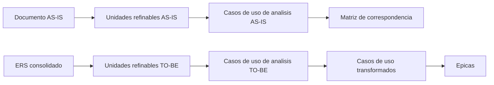

# Dimagraf - Skills y Análisis

Repositorio documental de trabajo para el relevamiento, refinamiento y estructuración funcional del proceso de importaciones de Dimagraf.

## Tabla de Contenidos

- [¿Qué es este repositorio?](#qué-es-este-repositorio)
- [Guía de Inicio Rápido](#guía-de-inicio-rápido)
- [Estructura del Proyecto](#estructura-del-proyecto)
- [Arquitectura de la Documentación](#arquitectura-de-la-documentación)
- [Funcionalidades Principales](#funcionalidades-principales)
- [¿Cómo Funciona?](#cómo-funciona)
- [Beneficios](#beneficios)
- [Casos de Uso](#casos-de-uso)
- [Flujo de Trabajo](#flujo-de-trabajo)
- [Componentes del Sistema](#componentes-del-sistema)
- [Filosofía del Proyecto](#filosofía-del-proyecto)
- [Documentación Disponible](#documentación-disponible)
- [Contribución](#contribución)
- [ITR](#itr)

## ¿Qué es este repositorio?

Este espacio reúne la documentación funcional y de análisis del proceso de importaciones de Dimagraf.
Sirve como base para transformar requerimientos en unidades refinables, casos de uso, épicas y trazabilidad entre el proceso actual y la solución futura.

No contiene una aplicación ejecutable ni define un stack de backend o frontend en este workspace.

## Guía de Inicio Rápido

### Prerrequisitos

| Recurso | Estado |
|---|---|
| Editor Markdown | Recomendado |
| Visor de `.docx` | Recomendado para fuentes originales |
| Git | Recomendado para versionado |

### Instalación

No aplica para ejecución de software.
Este repositorio es documental y no requiere dependencias de runtime.

### Ejecutar el Proyecto

No hay un proyecto ejecutable en este workspace.
El uso principal es abrir, editar y mantener los archivos Markdown de análisis.

## Estructura del Proyecto

```text
.
├─ Analisis/
│  ├─ Unidades-Refinables/
│  ├─ Caso-Uso-Analisis/
│  ├─ Caso-Uso-Analisis-ASIS/
│  ├─ Caso-Uso-Transformados/
│  └─ Epicas/
├─ skills/
└─ _Dimagraf-ERS-Consolidado-v1.0.txt
```

### Carpetas relevantes

- `Analisis/Unidades-Refinables`: extracción funcional pre-CU
- `Analisis/Caso-Uso-Analisis`: refinamiento funcional
- `Analisis/Caso-Uso-Analisis-ASIS`: casos de uso del proceso actual
- `Analisis/Caso-Uso-Transformados`: casos de uso estandarizados
- `Analisis/Epicas`: agrupación funcional por dominio
- `skills/`: definición de skills usados en el flujo

## Arquitectura de la Documentación



## Funcionalidades Principales

- Extracción de unidades refinables desde fuentes documentales
- Refinamiento funcional de requerimientos
- Transformación a casos de uso estandarizados
- Agrupación de casos de uso en épicas
- Trazabilidad entre AS-IS y TO-BE
- Gestión de dudas e incoherencias por caso de uso
- Registro de issues y análisis de correcciones funcionales

## ¿Cómo Funciona?

1. Se lee el documento fuente.
2. Se extraen unidades refinables.
3. Se refinan las intenciones funcionales.
4. Se transforman a casos de uso estandarizados.
5. Se agrupan en épicas.
6. Se vincula el proceso actual con el futuro mediante matrices de correspondencia.

## Beneficios

- Ordena el análisis funcional de extremo a extremo
- Reduce ambigüedades antes de implementar
- Facilita el trabajo entre negocio, análisis y desarrollo
- Conserva trazabilidad entre el proceso actual y la solución futura
- Permite navegar la documentación con una estructura consistente

## Casos de Uso

Escenarios principales documentados:

- Gestión de orden de compra
- Embarques y subcarpetas
- Seguimiento de producción
- Documentación de embarque
- Tránsito y arribos
- Despacho aduanero
- Recepción en depósito
- Pagos, costeo y reportes
- Validación automática contra OC

## Flujo de Trabajo

1. Se identifica el documento de origen.
2. Se extraen unidades refinables.
3. Se refinan las unidades ambiguas.
4. Se transforman en casos de uso.
5. Se agrupan en épicas.
6. Se ajusta la trazabilidad con el proceso AS-IS.

## Componentes del Sistema

- `skills/`: catálogo de skills de trabajo
- `Analisis/`: documentación funcional y de trazabilidad
- `Analisis/Unidades-Refinables`: insumo inicial de análisis
- `Analisis/Caso-Uso-Analisis`: refinamiento funcional
- `Analisis/Caso-Uso-Analisis-ASIS`: lectura del proceso actual
- `Analisis/Caso-Uso-Transformados`: casos de uso formales
- `Analisis/Epicas`: backlog agrupado por dominio

## Filosofía del Proyecto

- Trazabilidad primero
- No inventar comportamiento
- Separar proceso actual de solución futura
- Mantener lenguaje funcional antes que técnico
- Documentar para decidir mejor

## Documentación Disponible

- [ERS consolidado](Analisis/Dimagraf-ERS-Consolidado-v1.0.docx)
- [Proceso actual de importaciones](Analisis/Dimagraf-Dis-Especificación proceso Importaciones.docx)
- [Unidades refinables ERS](Analisis/Unidades-Refinables/README.md)
- [Unidades refinables AS-IS](Analisis/Unidades-Refinables/README-Discovery-Proceso-Importaciones.md)
- [Casos de uso de análisis TO-BE](Analisis/Caso-Uso-Analisis/README.md)
- [Casos de uso de análisis AS-IS](Analisis/Caso-Uso-Analisis-ASIS/README.md)
- [Casos de uso transformados](Analisis/Caso-Uso-Transformados/README.md)
- [Matriz de correspondencia AS-IS -> TO-BE](Analisis/Caso-Uso-Analisis-ASIS/Matriz-Correspondencia.md)
- [Agrupación en épicas](Analisis/Epicas/README.md)
- [Issues y análisis de correcciones](Analisis/Issues/README.md)
- [Análisis de issues de importaciones](Analisis/Issues/Entendimiento-issues-importaciones.md)

## Documentación Generada Recientemente

- [Épicas funcionales del proceso](Analisis/Epicas/README.md)
- [Catálogo de skills](skills/README.md)
- [Changelog de issues](Analisis/Issues/Changelog-issues-importaciones.md)

## Contribución

Este repositorio se trabaja como un entorno colaborativo de análisis.
Buenas prácticas recomendadas:

- mantener trazabilidad entre archivos
- no borrar dudas sin resolverlas
- evitar duplicar contenido entre niveles de análisis
- conservar nombres consistentes de CU y UR

## ITR

ITR es una compañía experta en tecnología que acompaña a sus clientes en su transformación digital.
Su foco incluye incubación de productos digitales, consultoría digital, equipos multidisciplinarios, automatización y gestión de datos.

### Firma institucional

ITR potencia a sus clientes para convertirlos en organizaciones digitales de vanguardia, combinando tecnología, innovación, colaboración y enfoque en resultados.

- Visión: ser referentes de la industria de IT y socios estratégicos de nuestros clientes.
- Propósito: crear impacto transformando negocios y experiencias mediante tecnología.
- Valores: pasión por la tecnología, agilidad, innovación, colaboración y empatía.

Sitio web: https://www.itrsa.com.ar/
