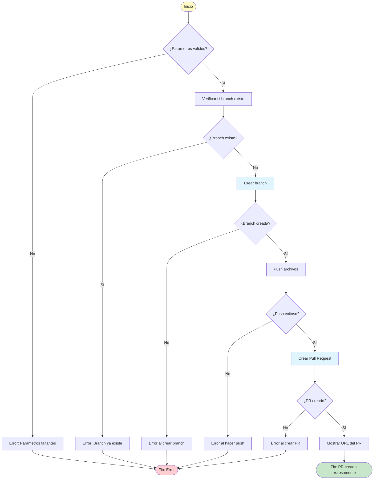

# Skill: Crear Branch y Pull Request

## 🎯 Objetivo

Este skill automatiza la creación de una rama de trabajo y un Pull Request usando las herramientas MCP de GitHub. Puede ser invocado directamente o como paso final de otros skills de implementación.

---

## 📥 Parámetros de Entrada

| Parámetro | Tipo | Requerido | Descripción |
|-----------|------|-----------|-------------|
| `tipo` | string | ✅ | Tipo de branch: `feature`, `bugfix`, `hotfix`, `setup` |
| `identificador` | string | ✅ | Identificador del cambio: `CU-XXX`, `issue-XXX`, o descripción |
| `descripcion` | string | ✅ | Descripción corta en kebab-case |
| `archivos` | array | ✅ | Lista de archivos a incluir en el commit |
| `mensaje_commit` | string | ✅ | Mensaje del commit (convención conventional commits) |
| `base_branch` | string | ❌ | Rama base (default: `dev`) |
| `titulo_pr` | string | ❌ | Título del PR (auto-generado si no se proporciona) |
| `body_pr` | string | ❌ | Body del PR (usa template si no se proporciona) |

---

## 📐 Convención de Nombrado

### Branches

| Tipo | Prefijo | Formato | Ejemplo |
|------|---------|---------|---------|
| Caso de Uso | `feature/` | `feature/CU-XXX-descripcion` | `feature/CU-001-registrar-profesional` |
| Caso de Uso UI | `feature/` | `feature/CU-XXX-descripcion-ui` | `feature/CU-001-registrar-profesional-ui` |
| Bug Fix | `bugfix/` | `bugfix/issue-XXX-descripcion` | `bugfix/issue-042-validacion-email` |
| Hotfix | `hotfix/` | `hotfix/descripcion` | `hotfix/critical-auth-error` |
| Setup/Infra | `setup/` | `setup/descripcion` | `setup/backend-initial-structure` |

### Commits (Conventional Commits)

```
<tipo>(<scope>): <descripción>

[cuerpo opcional]

[footer opcional]
```

**Tipos válidos:**
- `feat`: Nueva funcionalidad
- `fix`: Corrección de bug
- `docs`: Documentación
- `style`: Formato (sin cambios de código)
- `refactor`: Refactorización
- `test`: Tests
- `chore`: Tareas de mantenimiento

**Ejemplos:**
```
feat(backend): implementar CU-001 Registrar Profesional
fix(auth): corregir validación de email vacío - Refs: #042
feat(frontend): implementar pantalla de registro - CU-001
```

---

## 🔄 Flujo de Ejecución

### Diagrama de Flujo



---

## 🔧 Herramientas MCP Utilizadas

### 1. Verificar Branches Existentes (Opcional)

```
mcp_github_list_branches
```

| Parámetro | Valor |
|-----------|-------|
| **repo** | (repositorio actual) |

### 2. Crear Branch

```
mcp_github_create_branch
```

| Parámetro | Valor |
|-----------|-------|
| **branch** | `{tipo}/{identificador}-{descripcion}` |
| **from_branch** | `{base_branch}` (default: `dev`) |
| **repo** | (repositorio actual) |

### 3. Push de Archivos

```
mcp_github_push_files
```

| Parámetro | Valor |
|-----------|-------|
| **branch** | `{tipo}/{identificador}-{descripcion}` |
| **files** | Array de objetos `{ path, content }` |
| **message** | `{mensaje_commit}` |
| **repo** | (repositorio actual) |

### 4. Crear Pull Request

```
mcp_github_create_pull_request
```

| Parámetro | Valor |
|-----------|-------|
| **title** | `{titulo_pr}` o auto-generado |
| **head** | `{tipo}/{identificador}-{descripcion}` |
| **base** | `{base_branch}` (default: `dev`) |
| **body** | `{body_pr}` o template por defecto |
| **repo** | (repositorio actual) |

---

## 📝 Templates de PR

### Template para Features (Casos de Uso)

```markdown
## 📋 Descripción

**Caso de Uso:** {identificador} - {descripcion}
**Tipo:** {BackEnd | FrontEnd | Full Stack}
**Documento:** [Link al CU](docs/Caso-Uso-Transformados/{archivo}.md)

## 🔄 Cambios Realizados

### Archivos Creados
{Lista de archivos creados}

### Archivos Modificados
{Lista de archivos modificados}

## ✅ Checklist

- [ ] Código sigue las convenciones del proyecto
- [ ] Tests unitarios agregados/actualizados
- [ ] Documentación actualizada
- [ ] Sin errores de compilación/linting
- [ ] Revisión de seguridad completada

## 🧪 Testing

- [ ] Tests unitarios pasan
- [ ] Tests de integración pasan (si aplica)
- [ ] QA manual completado (si aplica)

## 📝 Notas Adicionales

{Cualquier información relevante para el reviewer}
```

### Template para Bug Fixes

```markdown
## 🐛 Fix de Issues

**Documento de Issues:** [Link](docs/Issues/{archivo}.md)
**Documento de Análisis:** [Link](docs/Issues/Entendimiento-{archivo}.md)

### Issues Resueltos

- [ ] Issue #{numero}: {título}

### 📋 Resumen de Cambios

**Causa:** {Breve descripción de la causa raíz}
**Solución:** {Descripción de la corrección implementada}

### Archivos Modificados

{Lista de archivos con descripción del cambio}

### ✅ Checklist

- [ ] Issue resuelto completamente
- [ ] Tests agregados para prevenir regresión
- [ ] No se introducen nuevos bugs
- [ ] Changelog actualizado

### 🧪 Testing

- [ ] Tests unitarios pasan
- [ ] Tests de regresión verificados
```

---

## 🚨 Manejo de Errores

### Error: Branch ya existe

```
❌ La branch '{nombre}' ya existe en el repositorio.

**Opciones:**
1. Usar otro nombre de branch
2. Eliminar la branch existente primero
3. Continuar trabajando en la branch existente
```

### Error: Push fallido

```
❌ Error al hacer push de los archivos.

**Posibles causas:**
- Permisos insuficientes
- Conflictos con archivos existentes
- Archivos muy grandes

**Solución manual:**
git checkout -b {nombre-branch}
git add {archivos}
git commit -m "{mensaje}"
git push origin {nombre-branch}
```

### Error: PR fallido

```
❌ Error al crear el Pull Request.

**Posibles causas:**
- PR ya existe para esta branch
- Branch no tiene commits nuevos
- Permisos insuficientes

**Solución manual:**
Ir a GitHub → Pull Requests → New Pull Request
Seleccionar base: {base} ← compare: {branch}
```

---

## 📤 Salida

Al completar exitosamente, el skill retorna:

```json
{
  "success": true,
  "branch": "feature/CU-001-registrar-profesional",
  "commit_sha": "abc123...",
  "pr_number": 42,
  "pr_url": "https://github.com/org/repo/pull/42"
}
```

Y muestra al usuario:

```
✅ Branch y PR creados exitosamente!

📌 Branch: feature/CU-001-registrar-profesional
📝 Commit: feat(backend): implementar CU-001 Registrar Profesional
🔗 Pull Request: https://github.com/org/repo/pull/42

El PR está listo para revisión.
```

---

## ⚠️ Consideraciones

1. **Permisos:** Asegurar que el token de GitHub tiene permisos de escritura (`repo` scope)
2. **Base branch:** Por defecto se usa `dev`, pero puede especificarse otra rama
3. **Archivos:** Deben proporcionarse con path relativo al root del repositorio
4. **Conflictos:** Si hay conflictos, se informará al usuario para resolución manual
5. **Draft PR:** Se puede crear como draft si se requiere más trabajo

---

## 🔗 Skills Relacionados

- `implementar-caso-uso-backend` - Invoca este skill al finalizar
- `implementar-caso-uso-frontend` - Invoca este skill al finalizar
- `generar-issue-fix` - Invoca este skill al finalizar

