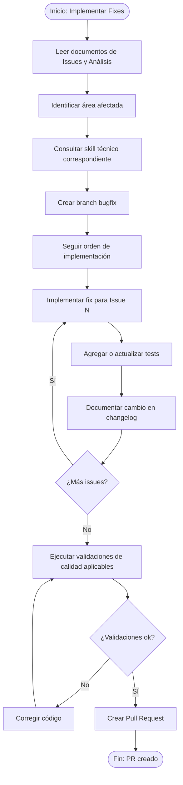

# Generador de Implementación de Fixes

## Objetivo

Este skill guía al agente IA para implementar correcciones de issues basándose en el documento de análisis previo generado con el skill `generar-issue-analisis`.

Su foco es **operativo**:

- ejecutar fixes reales
- seguir el plan de cambios ya analizado
- validar calidad y cobertura
- documentar cambios
- cerrar el circuito con branch, commit y PR

Este skill **no define stack por sí mismo**. Cuando el fix afecte un área técnica concreta, debe alinearse con el skill fuente de verdad correspondiente.

---

## Entrada

**Contexto requerido:**

1. Documento de Issues: `docs/Issues/[nombre-archivo].md`
2. Documento de Análisis y Entendimiento: `docs/Issues/Entendimiento-[nombre-archivo].md`

---

## Salida

- **Branch:** `bugfix/issue-XXX-descripcion`
- **Changelog:** `docs/Issues/Changelog-[nombre-archivo].md`
- **Pull Request:** hacia rama `dev` con resumen de cambios

---

## Fuentes de Verdad a Respetar

Según el tipo de fix, consultar y respetar:

- `generar-issue-analisis`
- `crear-branch-pr`
- `arquitectura-stack-tecnologico-backend`
- `arquitectura-stack-tecnologico-frontend`
- `generar-solucion-backend`
- `generar-solucion-frontend`
- `implementar-caso-uso-backend`
- `implementar-caso-uso-frontend`
- `procesamiento-asincrono-backend`

Regla:

- si el fix afecta backend, derivar y alinear con el universo backend
- si el fix afecta frontend, derivar y alinear con el universo frontend
- si el fix afecta procesamiento asíncrono persistido, remitir a `procesamiento-asincrono-backend`

---

## Instrucciones para la IA

### Pasos a Ejecutar

1. Leer el documento de análisis previo
2. Identificar el área afectada por cada issue
3. Determinar si el fix impacta:
   - backend
   - frontend
   - datos
   - contrato API
   - procesamiento asíncrono persistido
4. Consultar los skills técnicos correspondientes antes de implementar
5. Crear rama de fix desde `dev`
6. Implementar las correcciones siguiendo el orden recomendado en el análisis
7. Actualizar o agregar tests según corresponda
8. Documentar cada cambio en el historial (Changelog)
9. Ejecutar validaciones de calidad consistentes con el área afectada
10. Crear Pull Request hacia `dev` con el resumen de cambios

### Regla de derivación técnica

**Si el fix afecta backend:**

- consultar `arquitectura-stack-tecnologico-backend`
- consultar `generar-solucion-backend` si el fix toca estructura base del servicio
- consultar `implementar-caso-uso-backend` si el fix afecta lógica de caso de uso, API, persistencia o capa de aplicación

**Si el fix afecta frontend:**

- consultar `arquitectura-stack-tecnologico-frontend`
- consultar `generar-solucion-frontend` si el fix toca baseline o scaffold
- consultar `implementar-caso-uso-frontend` si el fix afecta integración, módulos, pantallas, hooks o tests de UI

**Si el fix afecta procesamiento asíncrono persistido:**

- consultar `procesamiento-asincrono-backend`

Regla adicional:

- `generar-issue-fix` ejecuta el fix
- no reemplaza a los skills de implementación especializados

---

## Convención de Nombrado

### Branch de Fix

```text
bugfix/issue-XXX-descripcion-corta
```

**Ejemplos:**

```text
bugfix/issue-042-validacion-email
bugfix/issue-087-error-paginacion
bugfix/CU-015-correccion-calculo-total
```

### Commits

```text
fix(<scope>): <descripción del cambio>

Refs: #issue-number
```

**Ejemplos:**

```text
fix(auth): corregir validación de email vacío

Refs: #042

fix(api): resolver error de paginación en listado

Refs: #087
```

---

## Template de Pull Request

```markdown
## Fix de Issues

**Documento de Issues:** [Link al archivo de Issues]
**Documento de Análisis:** [Link al archivo de Análisis]

### Issues Resueltos
- [ ] Issue #1: [Título]
- [ ] Issue #2: [Título]

### Resumen de Cambios

#### Issue #1: [Título]
**Causa:** [Breve descripción de la causa raíz]
**Solución:** [Descripción de la corrección implementada]

**Archivos modificados:**
- `[ruta/archivo-1]` - [Descripción del cambio]
- `[ruta/archivo-2]` - [Descripción del cambio o tests]

#### Issue #2: [Título]
[Repetir estructura]

---

### Validaciones
- **Tests ejecutados:** XX/XX pasaron
- **Cobertura:** XX%
- **Build/verify:** exitoso si aplica
- **Lint/format/checks:** exitoso si aplica

### Checklist
- [x] Código sigue las convenciones del proyecto
- [x] Se respetó el skill técnico correspondiente al área afectada
- [x] Todos los tests relevantes pasan
- [x] Cobertura mínima mantenida (si aplica)
- [x] Sin errores de validación de calidad aplicables
- [x] Cambios documentados en historial
- [ ] `docs/Datos/Modelo-Datos.md` actualizado (si aplica cambios de datos)

### Historial de Cambios
Ver archivo: `docs/Issues/Changelog-[nombre-archivo].md`

### Referencias
- Issues originales: [Link]
- Análisis: [Link]
- CU/HU relacionado: [CU-XXX]
```

---

## Template de Changelog

**Ubicación:** `docs/Issues/Changelog-[nombre-archivo].md`

```markdown
# Changelog de Fix: [ID-ISSUE o Nombre del Lote]

## [Fecha: dd/mm/aaaa]

### Issue #1: [Título]
**Estado:** Resuelto

#### Cambios Realizados
| Archivo | Tipo de Cambio | Descripción |
|---------|----------------|-------------|
| `[ruta/archivo-1]` | Modificación | [Descripción detallada] |
| `[ruta/archivo-2]` | Nuevo | [Descripción detallada] |

#### Código Anterior
```text
[Fragmento relevante anterior]
```

#### Código Nuevo
```text
[Fragmento relevante corregido]
```

#### Tests Agregados o Ajustados
- [Descripción de test 1]
- [Descripción de test 2]

---

### Issue #2: [Título]
[Repetir estructura]

---

## Resumen
- **Total issues resueltos:** X
- **Archivos modificados:** X
- **Tests agregados o ajustados:** X
- **Tiempo de implementación:** X horas
```

---

## Flujo de Implementación



---

## Verificación de Diseño de Base de Datos

> **OBLIGATORIO cuando el fix afecta esquema, entidades, migraciones o consistencia documental de datos**

Cuando el fix requiera crear o modificar entidades, tablas, relaciones o migraciones, verificar el cumplimiento de las reglas de diseño de datos establecidas en el skill `arquitectura-stack-tecnologico-backend`.

### Checklist Pre-Implementación de Datos

| Verificación | Estado | Notas |
|--------------|--------|-------|
| La nueva estructura respeta las reglas del proyecto | ◻️ | |
| La nomenclatura sigue la convención vigente | ◻️ | |
| No se propagan violaciones existentes a código nuevo | ◻️ | |
| Los cambios documentales de datos están identificados | ◻️ | |

### Manejo de Violaciones Detectadas

Si el issue se origina por una violación estructural o documental en datos:

1. documentar la violación encontrada
2. corregirla si entra en alcance
3. si el refactoring excede el fix, dejar recomendación explícita para trabajo posterior
4. no introducir nuevo código que perpetúe la inconsistencia

---

## Actualización del Modelo de Datos

> **OBLIGATORIO cuando el fix modifica estructura de datos o documentación asociada**

Si el fix modifica:

- entidades
- campos
- relaciones
- catálogos
- índices
- constraints

entonces debe evaluarse la actualización de `docs/Datos/Modelo-Datos.md`.

### Checklist de Actualización

- [ ] Identificar si el fix involucra cambios de estructura de datos
- [ ] Actualizar las secciones correspondientes en `docs/Datos/Modelo-Datos.md`
- [ ] Agregar entrada en historial de cambios del documento si aplica
- [ ] Documentar la actualización del modelo en el changelog del fix

---

## Criterios de Aceptación del Fix

- [ ] Todos los issues del lote están resueltos
- [ ] Se respetó el análisis previo
- [ ] Se consultó el skill técnico correcto según el área afectada
- [ ] Los tests relevantes pasan
- [ ] Las validaciones de calidad aplicables pasaron
- [ ] El changelog quedó documentado
- [ ] `docs/Datos/Modelo-Datos.md` fue actualizado si el fix afecta datos
- [ ] El PR quedó creado con descripción completa
- [ ] Se referenciaron correctamente issues y análisis

---

## Notas Importantes

1. Priorizar estabilidad: no introducir nuevos bugs al corregir los existentes
2. Cambios atómicos: cada commit debe ser razonablemente reversible
3. Validar primero el área afectada antes de ejecutar cambios técnicos
4. Documentar siempre los cambios y supuestos relevantes
5. No usar este skill como sustituto de los skills especializados de backend o frontend

---

## Referencias

- Documentos de Issues: `docs/Issues/`
- Skills relacionados:
  - `generar-issue-analisis`
  - `crear-branch-pr`
  - `arquitectura-stack-tecnologico-backend`
  - `arquitectura-stack-tecnologico-frontend`
  - `generar-solucion-backend`
  - `generar-solucion-frontend`
  - `implementar-caso-uso-backend`
  - `implementar-caso-uso-frontend`
  - `procesamiento-asincrono-backend`

---

## Paso Final: Automatización Git

Al completar la implementación de los fixes, el agente debe invocar el skill `crear-branch-pr` con parámetros consistentes con el fix realizado.

| Parámetro | Valor sugerido |
|-----------|----------------|
| `tipo` | `bugfix` |
| `identificador` | `issue-XXX` o identificador funcional equivalente |
| `descripcion` | `{descripcion-corta-del-fix}` |
| `archivos` | archivos corregidos + changelog |
| `mensaje_commit` | `fix(scope): descripción del fix - Refs: #issue-XXX` |
| `base_branch` | `dev` |
| `titulo_pr` | `[FIX] Issue XXX - {Descripción corta}` |

**Ejemplos de branch resultante:**

- `bugfix/issue-042-validacion-email`
- `bugfix/CU-002-TC0009-registro-solicitante`

> **Importante:** incluir el archivo Changelog en el push y referenciar los números de issue en el commit message.
>
> **Referencia:** ver skill `crear-branch-pr`
